# Monthly prediction for Bixi rides in Montreal
The final project for big data infrastructure course by **Hamid Reza Taremian**

# Setting up google cloud platform
### 1. First we need to set up a **bucket** to have a storage for our project

### 2. Then we need to make a cluster for our project using command shell which will allow jupyter notebook using the followinf command:
      gcloud beta dataproc clusters create infra_projcet \
    --optional-components=ANACONDA,JUPYTER \
    --image-version=1.3 \
    --enable-component-gateway \
    --bucket infra_project \
    --project big-data-infrastructure-pro

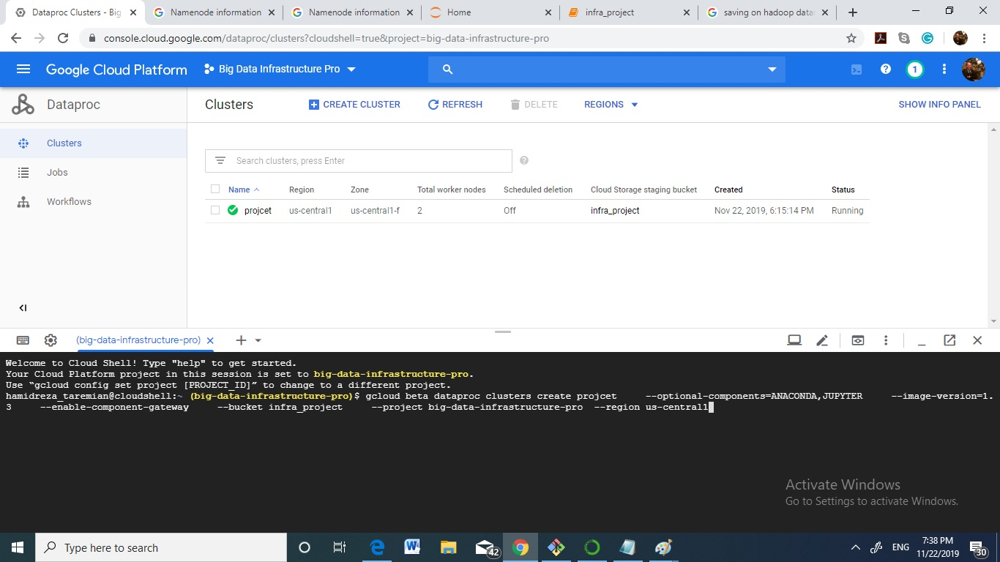

### 3. Now we can have access to jupyter notebook to write our code

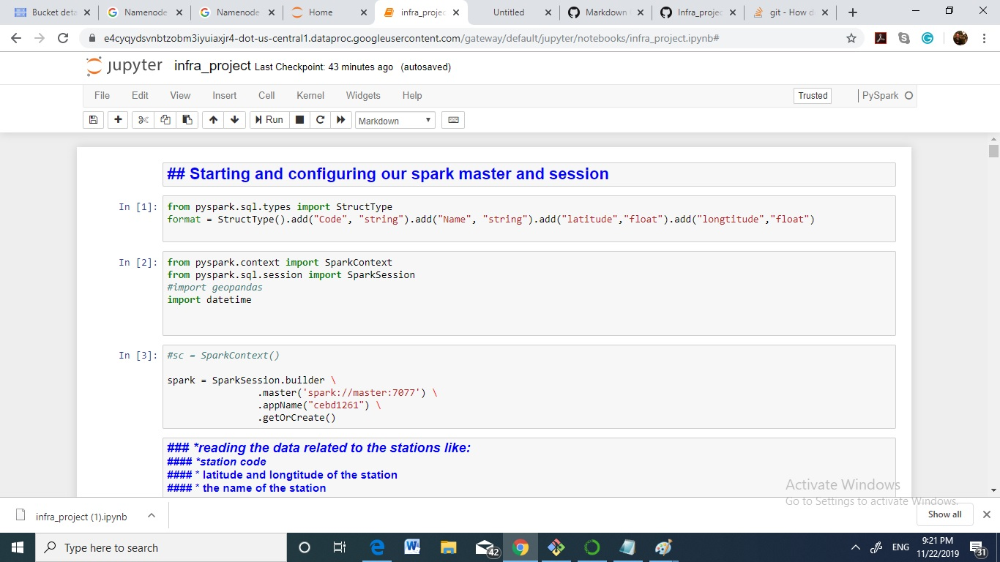

# The python+spark code
* our data consists of one CSV file for the information related to the each station and CSV files for monthly rides. so first we upload our files into the bucket that we made before.

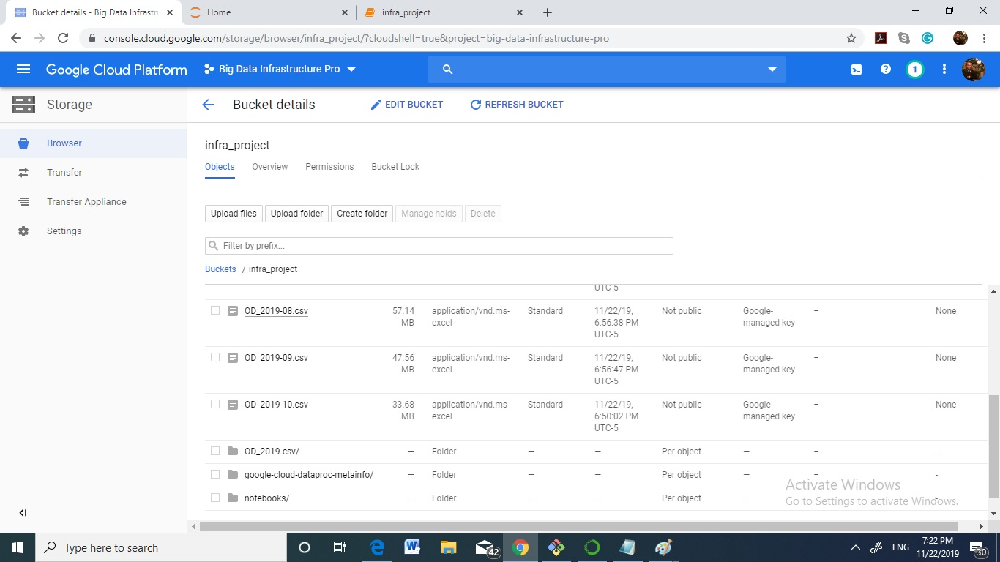

* we can read the data for stations and each month separately.
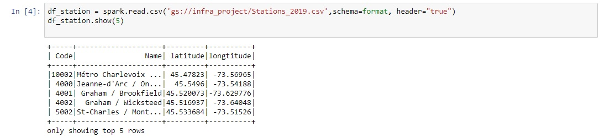

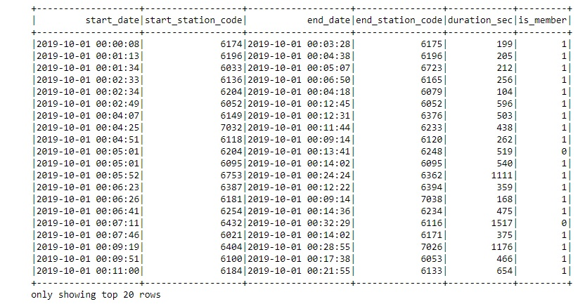

## Some Analysis
* we can see howmany rides were done from each station and link the station geogrphical information for furthure usage
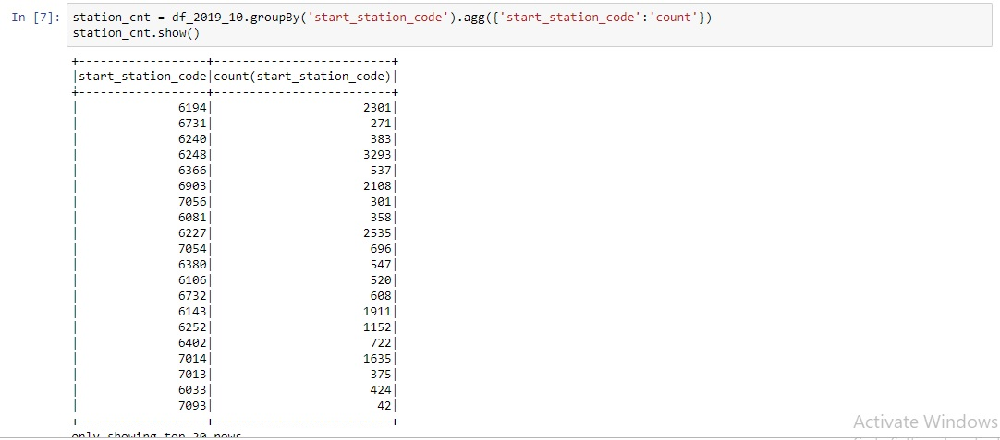

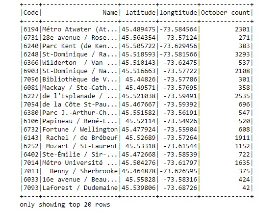

* we can decide which rides happened dring the same day and how many were more than one day
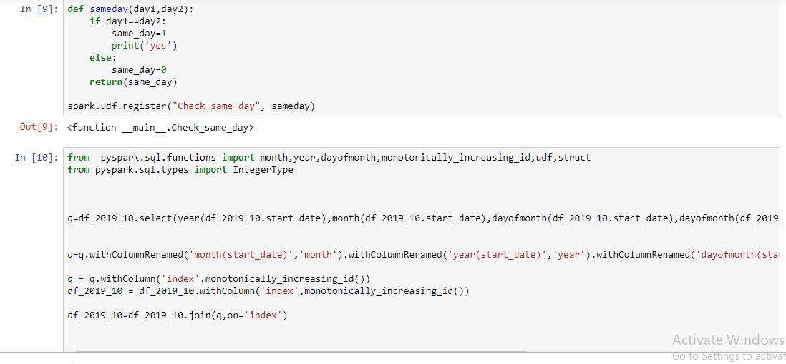
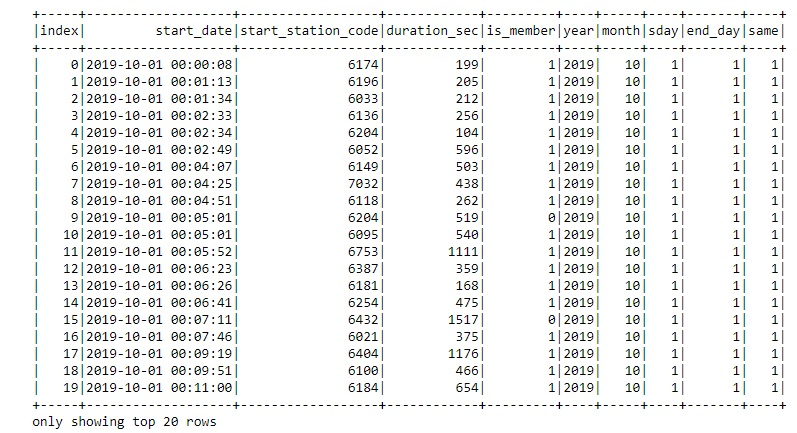
### predictions
* The data at hand is  time related so we have to run time sereies predictions on it.The step will be as follows:
   1. extract the average time per ride and total number of rides per month for each station
   2. put all these together to have the information for year 2019
   3. run time series prediction 

* we can extract the avergae time and number of rides per station using the code below:

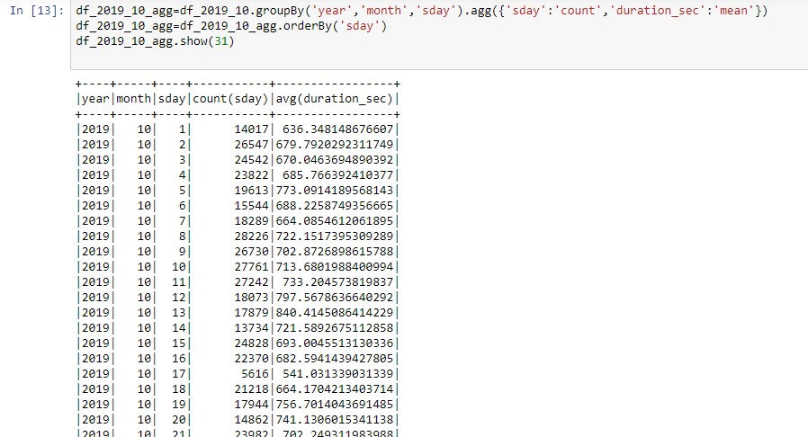

* we can also plot this information
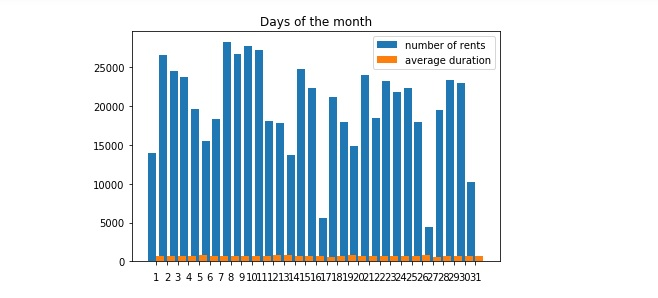

* after extracting all the month information now we can have all infrmation in one table

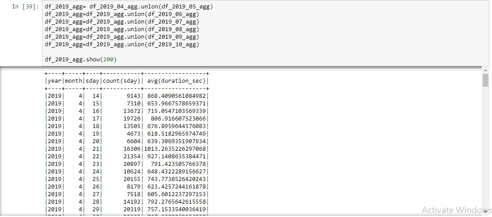

* now we can do the final cleaning 
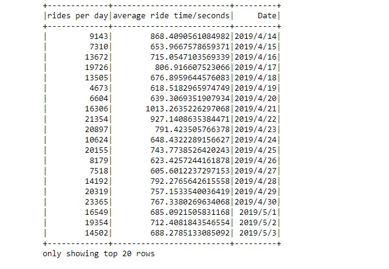

* we can save the resulting table in Google cloud bucket that we made for our project and below we can see its partitions

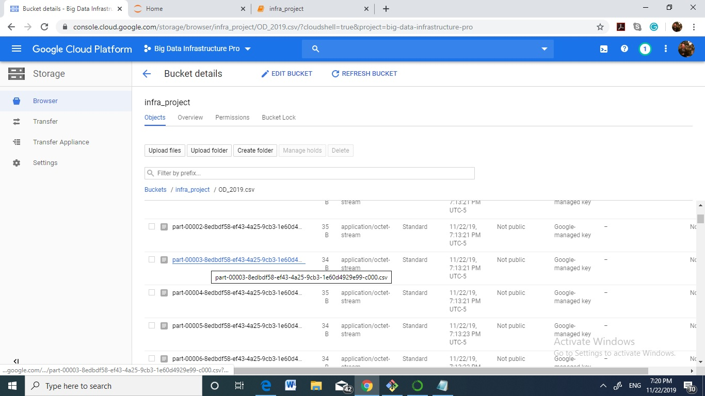

* also on hdfs

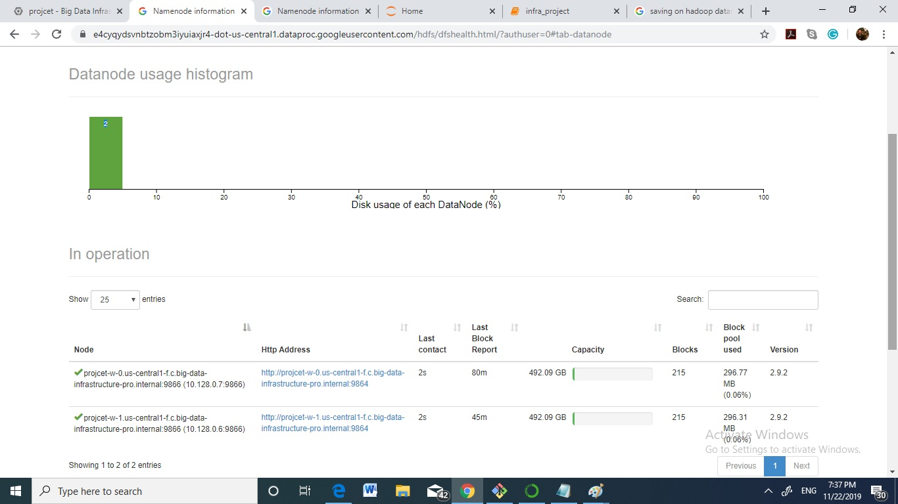

* after the data is ready we can run the ARIMA time series prediction
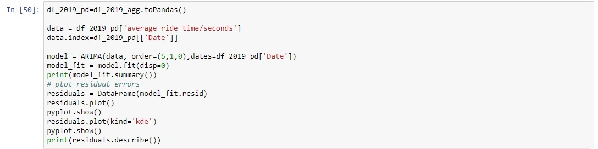

* the result

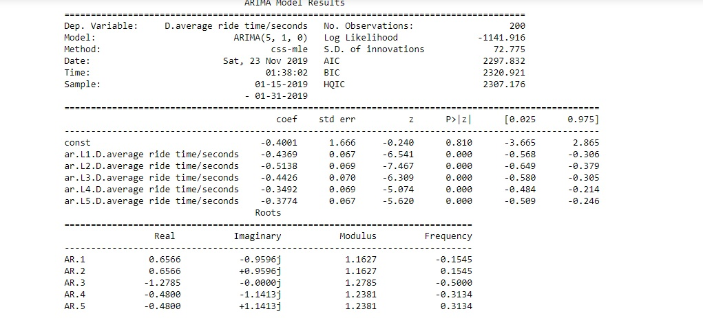

* arima output plots

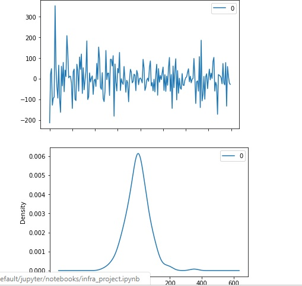
