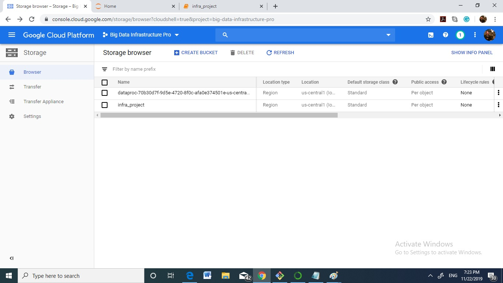

# Infra_project
The final project for big data infrastructure course by **Hamid Reza Taremian**

# Setting up google cloud platform
### 1. First we need to set up a **bucket** to have a storgae for our proejct

### 2. Then we need to make a cluster for our project using command shell which will allow jupyter notebook using the followinf command:
...* gcloud beta dataproc clusters create infra_projcet \
    --optional-components=ANACONDA,JUPYTER \
    --image-version=1.3 \
    --enable-component-gateway \
    --bucket infra_project \
    --project big-data-infrastructure-pro

